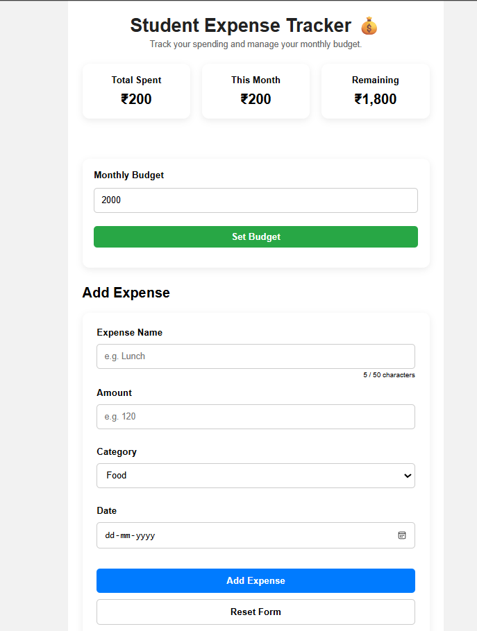
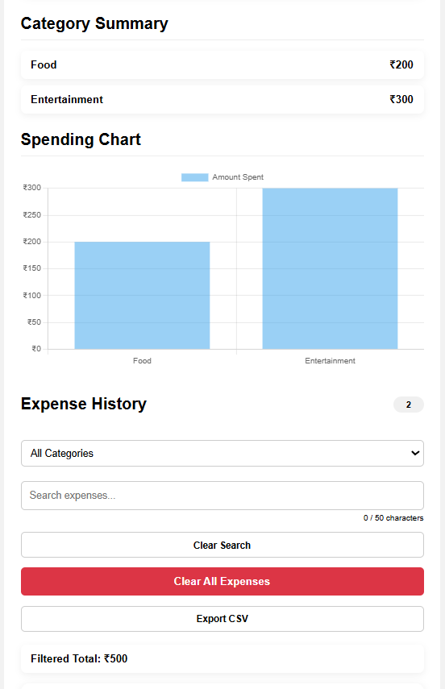
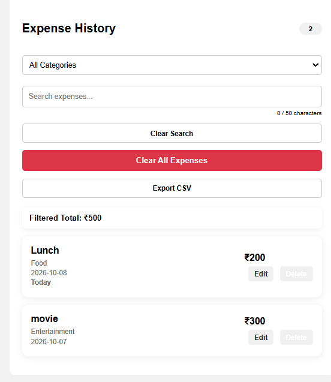

# Student Expense Tracker

A simple web-based expense tracker designed for students.

## Features

- Add and manage expenses
- Edit and delete expenses
- Monthly budget tracking
- Total and monthly spending calculation
- Category-wise expense summary
- Spending chart
- Search and category filtering
- Expense date validation
- Duplicate expense prevention
- Indian Rupee (₹) formatting
- Export expenses to CSV
- Data saved using localStorage
- Responsive design for mobile devices

## Technologies Used

- HTML
- CSS
- JavaScript
- Chart.js

## How to Run

1. Download or clone the project.
2. Open the project folder in VS Code.
3. Open `index.html` using Live Server.
4. The Student Expense Tracker will open in your browser.

## Screenshots

### Dashboard



### Expense Management



### Expense History and Chart




## Project Structure

```text
student-expense-tracker/
│
├── index.html
├── style.css
├── script.js
└── README.md


## Future Improvements

- Add user login and authentication
- Add dark mode
- Add income tracking
- Add savings goals
- Add monthly and yearly reports
- Add downloadable PDF reports
- Add cloud database support
- Add more detailed charts

## License

This project is licensed under the MIT License.